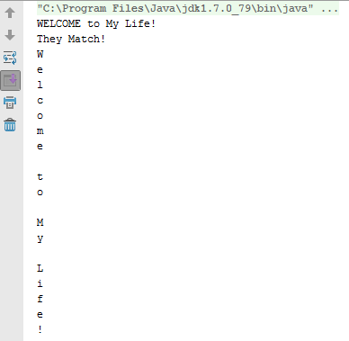

# String

~~~
package ph.edu.dlsu;

public class Main {

    public static void main(String[] args) {

        String s1 = "Welcome to My Life!";
        String s2 = new String("WELCOME to My Life!");
        System.out.println(s2);

        if (s1.equalsIgnoreCase(s2)) {
            System.out.println("They Match!");
        }
        else {
            System.out.println("They don't Match!");
        }
        
        char[] chars = s1.toCharArray();
        for (char c : chars) {
            System.out.println(c);

        }
            
        }
    }

~~~
